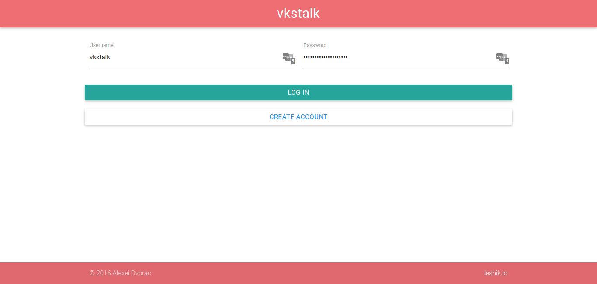

# vkstalk-js
Collect and analyze VK.com user's public information  

- [What's a USER_ID](#user-id)
- [Walkthrough](#walkthrough)
- [Setup](#setup)

### User ID  
A USER\_ID is the string that comes after the `vk.com/`.  
Example: `https://vk.com/alexei.dvorac` => `USER_ID = alexei.dvorac`  
Example #2: `https://vk.com/id999999999` => `USER_ID = id999999999`

### Walkthrough  
1. Log in/Create account. Input your credentials. If you have an account click login OR press ENTER, otherwise click "Create account"  
  
2. Home page.  
!(Homepage)[docs/screenshots/2_main.png)  
To add users, input USER\_ID and press ENTER or click "ADD".  
!(Users added)[docs/screenshots/3_added_users.png)  
You can add as many USER_IDs as you want, however, there is a limit of max running stalkers per account, currently it is **2**.
!(Stalked users limit)[docs/screenshots/9_limit_users.png)  
Also, there is a global limit of **5** concurrent workers. So, if you're not interested OR not going to use the app, please stop the stalkers that you have started.  
3. Start the stalker by clicking "STALK" in any of the added USER\_ID cards  
!(Stalker started)[docs/screenshots/4_stalker_started.png)  
4. To see reports. Click on "REPORTS" in any of the stalking cards.  
!(Reports main)[docs/screenshots/5_reports_main.png)  
5. Choose a report type. Some allow additional filtering (e.g. by date and/or time)  
!(Report types)[docs/screenshots/6_report_types.png)  
The reports look like this  
Music  
!(Report music)[docs/screenshots/8_report_music.png)  
Updates  
!(Report updates)[docs/screenshots/7_report_updates.png)  

### Tips and tricks  
- You cannot start more than 2 workers, but you can add as many user IDs as you wish. This allows you to generate/view reports for any number of users if there is any data on their USER\_ID. So, you can either periodically start/stop stalkers OR if you're lucky and someone else has collected (or is collecting) some data on USER\_ID, you can generate reports without ever starting the stalker.  
- There is a console interface that provides the same functionality as the web interface (stalk/report). Just follow the setup steps.
- You can run just the stalker, to collect data. By default it will output plenty of log messages and data, to prevent this, change the log_level in (config.json)[src/config/config.json]
- Take a look at (config.json)[src/config/config.json]. You can add custom fields to be parsed, by specifying the `type`, `selector` and `name` (this will work for renaming currently scraped fields, however, reports and other output might break because of missing data)

### Setup

- Install [NodeJS](https://nodejs.org/en/) >= v6.2.2 [(ubuntu help)](http://stackoverflow.com/questions/20031849/how-can-i-find-my-node-js-files-in-linux-usr-bin-node-is-not-working/32740546#32740546)  
- Install mongodb  
- Install [PhantomJS](http://phantomjs.org/)  
- Navigate to `./src` and run `npm install`  
- Use `./config/db_sample_config.json` to create `./config/db.json`; Update config with your DB credentials.
- Use `./config/secrets_sample.json` to create `./config/secrets.json`; Add your secret key.
- Navigate to `src` dir. To launch the app:  
    -- Just stalker: `./stalker/run stalk USER_ID` (You'll see plenty of log messages and unformatted data. Log level can be changed in config)  
    -- Console: `./console/run/ stalk USER_ID` (Formatted output in console)  
    -- Web: `node ./web/server.js` (The most user friendly option. Will start an Express server, providing point-and-click control over stalker's functionality)  

`USER_ID` is to be replaced with the ID of the target user.  

To get the full list of accepted commands (by either stalker OR console) and options use `./stalker run help`
